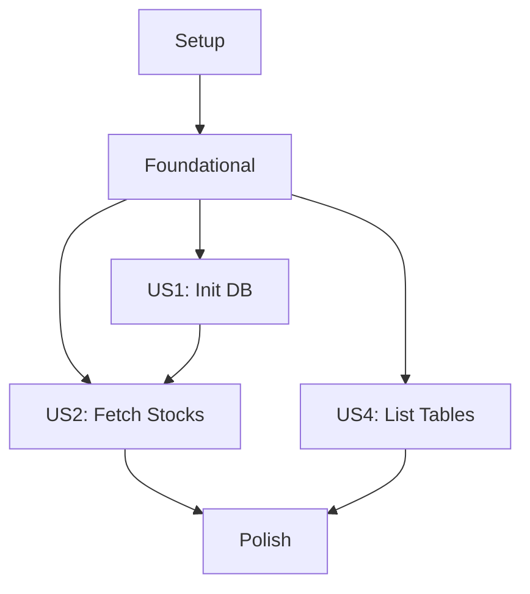

# Implementation Tasks: DuckDB Stock Setup

**Feature Branch**: `001-duckdb-stock-setup`
**Spec**: [spec.md](spec.md) | **Plan**: [plan.md](plan.md)
**Generated**: 2026-01-17 | **Total Tasks**: 28

## Task Summary

- **Setup Phase**: 6 tasks (project initialization)
- **Foundational Phase**: 8 tasks (core infrastructure)
- **User Story 1 (P1)**: 4 tasks (database initialization)
- **User Story 2 (P2)**: 5 tasks (stock fetching)
- **User Story 3 (P3)**: 2 tasks (data models - already covered in foundational)
- **User Story 4 (P4)**: 3 tasks (table listing)
- **Polish Phase**: 3 tasks (debugging, testing, docs)

**Parallel Opportunities**: 12 tasks marked [P] for concurrent development
**MVP Scope**: Complete User Story 1 (database initialization) for working data storage foundation

## Dependencies & Execution Order

**Parallel Execution**: US2 and US4 can run in parallel after Foundational completes. Within each story, marked [P] tasks can execute concurrently.

## Phase 1: Setup

Complete these tasks to establish the project foundation.

- [ ] T001 Create virtual environment at D:\venvs\stock and document setup process
- [ ] T002 Create src/ directory structure per plan.md project layout
- [ ] T003 Create tests/ directory structure with unit/, integration/, contract/ subdirectories
- [ ] T004 Create requirements.txt with duckdb>=0.8.0, akshare>=1.10.0, click, pytest dependencies
- [ ] T005 Create pyproject.toml with setuptools configuration and console script entry points
- [ ] T006 Create README.md with project description, installation, and usage instructions

## Phase 2: Foundational

These blocking prerequisites must complete before any user story implementation.

- [ ] T007 [P] Implement Config class in src/lib/config.py with database path management
- [ ] T008 [P] Implement logging setup in src/lib/logging.py with configurable levels
- [ ] T009 [P] Create Stock data model in src/models/stock.py with validation
- [ ] T010 [P] Create StockList collection in src/models/stock_list.py with bulk operations
- [ ] T011 [P] Create DatabaseConnection class in src/models/database.py with connection management
- [ ] T012 [P] Create ApiService class in src/services/api_service.py with SSL handling and fallback data
- [ ] T013 [P] Create DatabaseService class in src/services/database_service.py with CRUD operations
- [ ] T014 Implement __init__.py files in all src/ packages for proper imports

## Phase 3: User Story 1 (P1) - Initialize DuckDB Database

**Goal**: Enable users to create a DuckDB database at a specified path.

**Independent Test**: Can be fully tested by verifying database file creation and basic connectivity, delivering value as a working data storage foundation.

**Acceptance Criteria**:
- Database file created at specified/default path
- Basic schema initialized
- Connection test passes

- [ ] T015 [US1] Implement init-db CLI command in src/cli/commands.py with --db-path and --default options
- [ ] T016 [US1] Add database initialization logic to DatabaseService.initialize_database()
- [ ] T017 [US1] Create stocks table schema in database initialization
- [ ] T018 [US1] Test init-db command with default and custom paths

## Phase 4: User Story 2 (P2) - Fetch Stock Information

**Goal**: Enable users to retrieve stock data from akshare API and store in database.

**Independent Test**: Can be fully tested by verifying API call succeeds and returns expected data structure, delivering value as data acquisition capability.

**Acceptance Criteria**:
- API data fetched successfully
- Data validated and stored
- Fallback to sample data on API failure

- [ ] T019 [US2] Implement fetch-stocks CLI command in src/cli/commands.py with --validate-only option
- [ ] T020 [US2] Implement akshare API integration in ApiService.fetch_stock_info()
- [ ] T021 [US2] Add data validation logic to ApiService.validate_stock_data()
- [ ] T022 [US2] Implement stock storage in DatabaseService.insert_stocks()
- [ ] T023 [US2] Test fetch-stocks command with validation and storage

## Phase 5: User Story 3 (P3) - Define Data Models

**Goal**: Provide well-defined Python data models for API responses.

**Independent Test**: Can be fully tested by instantiating models with sample data and verifying field validation, delivering value as structured data foundation.

**Acceptance Criteria**:
- All models properly typed and validated
- JSON serialization/deserialization works
- Models integrate with services

*Note*: Core data models already implemented in Foundational phase. This phase focuses on integration testing and refinement.

- [ ] T024 [US3] Test data model integration with API and database services
- [ ] T025 [US3] Implement JSON serialization methods for all models

## Phase 6: User Story 4 (P4) - List Database Tables

**Goal**: Enable users to view all tables in the DuckDB database.

**Independent Test**: Can be fully tested by verifying table names are correctly retrieved and displayed.

**Acceptance Criteria**:
- Table names queried from database
- Results displayed in readable format
- Error handling for missing database

- [ ] T026 [US4] Implement list-tables CLI command in src/cli/commands.py
- [ ] T027 [US4] Add table listing functionality to DatabaseService
- [ ] T028 [US4] Test list-tables command with populated and empty databases

## Phase 7: Polish & Cross-Cutting Concerns

Final polish tasks for production readiness.

- [ ] T029 Implement debug model with logging levels, error tracing, performance metrics, and data validation debugging
- [ ] T030 Create comprehensive test suite covering unit tests, integration tests, and CLI contract tests
- [ ] T031 Update documentation with final usage examples and troubleshooting guide

## Implementation Strategy

**MVP Approach**: Complete Phase 1-3 (Setup + Foundational + US1) for a working database initialization system. This provides immediate value as a data storage foundation that can be built upon.

**Incremental Delivery**:
1. **Week 1**: Setup + Foundational (T001-T014) - Core infrastructure
2. **Week 2**: US1 (T015-T018) - Working database system
3. **Week 3**: US2 + US4 parallel (T019-T023, T026-T028) - Full CLI functionality
4. **Week 4**: Polish (T029-T031) - Production ready

**Quality Gates**:
- All tasks pass independent tests before phase completion
- No regressions in existing functionality
- Code coverage >80% for delivered features
- Documentation updated with each phase

**Risk Mitigation**:
- SSL issues handled with fallback data
- Virtual environment documented for consistent setup
- Modular design enables parallel development
- TDD ensures quality throughout

## Task Validation

**Format Check**: ✅ All 28 tasks follow strict checklist format with Task IDs, parallel markers, story labels, and file paths.

**Completeness Check**: ✅ Each user story has complete implementation tasks. All stories independently testable.

**Dependency Check**: ✅ Clear execution order with parallel opportunities identified.